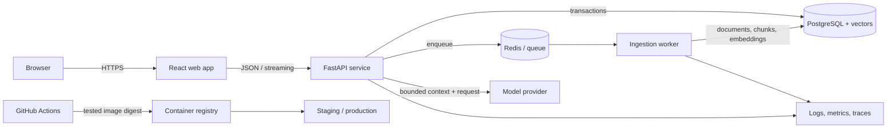

# Capstone: Grounded

Grounded is a multi-user knowledge assistant that ingests a chosen document collection and answers questions with evidence-linked citations. It is intentionally small enough to finish and rich enough to exercise the foundations of production AI engineering.

Use a harmless public or synthetic document set: project documentation, public policy, public research papers, or your own notes. Do not upload employer data, credentials, medical records, or other sensitive material to third-party model services.

## User story

As an authenticated user, I can create a collection, add supported documents, observe ingestion, ask questions, inspect the cited source passages, and delete my data. If the collection does not support an answer, the assistant says so clearly.

## Reference architecture



The diagram is a reference, not a mandatory vendor list. A simple stack is preferred over extra infrastructure without a measured need.

## Functional requirements

1. A user can authenticate and can access only their own collections and documents.
2. The system accepts Markdown and plain text; an HTTP source is optional and strictly constrained.
3. Ingestion is asynchronous, idempotent, observable, and safe to retry.
4. Documents are normalized, chunked deterministically, embedded, and versioned.
5. The system retrieves authorized evidence and produces a structured answer with valid citations.
6. It abstains when the available evidence is insufficient.
7. Users can inspect source passages and delete a collection.
8. A fake model mode supports local development, conventional tests, and most load tests without a paid API.

## Non-functional requirements

- **Reproducibility:** a clean checkout can run locally from declared versions and one documented command sequence.
- **Correctness:** types, unit/integration/browser tests, migrations, and a versioned AI evaluation set protect behavior.
- **Security:** least privilege, tenant filters, validation, safe rendering, secret management, dependency/secret scans, and explicit confirmation for side effects.
- **Reliability:** timeouts, bounded retries, idempotency, health/readiness checks, backups, rollback, and graceful degradation.
- **Observability:** request/job/run correlation across structured logs, metrics, and traces without leaking private content.
- **Performance:** measured p50/p95 latency, a stated capacity envelope, bounded queues/context, and concurrency control.
- **AI quality:** retrieval and answer quality measured separately across meaningful dataset slices.
- **Cost:** token usage and infrastructure estimates visible per representative task, with spending limits or alerts.
- **Privacy:** documented data flow, provider handling assumptions, retention, and deletion behavior.
- **Accessibility:** keyboard-usable UI, semantic structure, labels, focus states, and understandable loading/error feedback.

## Suggested repository shape

```text
grounded-ai/
├── .github/workflows/       # CI and deployment
├── apps/
│   ├── api/                 # FastAPI transport/composition
│   └── web/                 # React/TypeScript interface
├── packages/
│   └── ingestion/           # document pipeline and CLI
├── workers/                 # background job entry points
├── evals/                   # versioned cases, runner, reports
├── tests/                   # cross-component and browser tests
├── deploy/                  # Compose and optional IaC
├── docs/
│   ├── adr/                 # architecture decisions
│   ├── runbooks/            # operational response
│   └── architecture.md
├── .env.example
├── AGENTS.md
├── README.md
└── compose.yaml
```

Adapt this after recording why. Do not create empty layers merely to match the diagram.

## Milestones

| Day | Deliverable | Acceptance evidence |
| ---: | --- | --- |
| 10 | `dev-doctor` shell CLI | Safe checks, lint/tests, clear exit status |
| 20 | Document-ingestion package | Clean install, deterministic chunks, typed/tests/logs |
| 30 | Full-stack document manager | Authenticated CRUD, database, worker, browser test |
| 40 | Source-citing assistant | Retrieval benchmark, citations, abstention, isolation tests |
| 50 | Containerized release candidate | Evals, threat model, telemetry, scans, Compose demo |
| 60 | Operated deployment and case study | CI/CD, HTTPS, SLO/runbook, recovery/load evidence, release |

## Minimum API surface

Exact paths may vary, but preserve these capabilities:

- `GET /health` — process health only;
- `GET /ready` — dependency readiness without sensitive details;
- `POST /collections` and `GET /collections`;
- `POST /collections/{id}/documents`;
- `GET /jobs/{id}`;
- `POST /collections/{id}/questions`;
- `DELETE /collections/{id}`;
- a stable structured error body containing code, safe message, and request ID.

All collection-scoped operations enforce the current user's ownership below the route layer as well as in database queries. Pagination has a maximum. Network and model calls have timeouts. Requests that create retryable work support idempotency.

## Evaluation slices

Your versioned evaluation set should include:

- direct, paraphrased, and multi-document answerable questions;
- unanswerable and ambiguous questions;
- conflicting and outdated sources;
- source-citation and quoted-span correctness;
- cross-tenant requests;
- prompt injection embedded in a document and in a question;
- long input, Unicode, empty content, and malformed model output;
- provider timeout, rate limit, and unavailable dependency.

Track retrieval hit-rate independently from groundedness, answer relevance, citation validity, abstention correctness, latency, and cost. A single blended score can conceal a dangerous failure.

## Definition of done

The capstone is complete when all of these are true:

- [ ] A new contributor can set up and run it from a clean checkout.
- [ ] Tool/runtime versions and dependencies are declared and locked.
- [ ] No secrets or private datasets exist in current files or Git history.
- [ ] Migrations build the database from empty and have a safe deployment plan.
- [ ] Unit, integration, contract, browser, and deterministic evaluation checks pass in CI.
- [ ] The live-model evaluation is reproducible, versioned, and reviewed before release.
- [ ] Authorization is enforced for routes, retrieval, tools, caches, and citations.
- [ ] Inputs/outputs are validated; network calls have timeouts and bounded retries.
- [ ] Prompts, models, embeddings, datasets, and image artifacts have identifiable versions.
- [ ] Images run as non-root, stop gracefully, are scanned, and contain no build secrets.
- [ ] Staging uses HTTPS, managed secrets, restricted network access, and synthetic data.
- [ ] Logs, metrics, traces, dashboards, SLOs, alerts, and a runbook support diagnosis.
- [ ] Backup restore and deployment rollback have been tested in a safe environment.
- [ ] Latency, capacity, AI quality, and cost are measured with stated assumptions.
- [ ] Privacy, retention, deletion, limitations, and accepted risks are documented.
- [ ] `v1.0.0` identifies the deployed commit and immutable image digest.
- [ ] Unused cloud resources are removed and budget alerts remain enabled.

## Optional extensions after Day 60

Choose extensions because a measured requirement demands them:

- hybrid lexical/vector search and reranking;
- object storage and additional document formats;
- feedback collection with privacy-safe analysis;
- multimodal retrieval;
- multi-region recovery;
- Kubernetes and infrastructure as code;
- a second model provider with contract and quality comparison;
- fine-tuning only after prompt/RAG/evaluation evidence justifies it.

