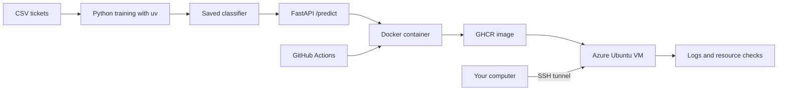

# Capstone: Ticket Classifier

Ticket Classifier is a small service that labels synthetic support messages as `billing`, `account`, or `technical`. It exists to connect the fundamentals—not to demonstrate advanced machine learning.

The student's exact phase-by-phase files, commands, endpoints, and expected outputs are listed in the [`ticket-classifier` workspace guide](../ticket-classifier/README.md).

## The connected path



The project stays the same while the way you work with it improves:

- Days 1–20: create files and learn to inspect the machine, errors, logs, processes, ports, HTTP, and SSH.
- Days 21–30: track the project with Git/GitHub and make one small assisted change.
- Days 31–40: create the Python project, train the classifier, test it, and serve predictions.
- Days 41–50: manage the process, containerize it, understand Azure resources, and deploy to a VM.
- Days 51–60: test/build it in GitHub Actions, publish a known image, monitor it, and recover it.

## Final repository shape

```text
acAIberry-foundations-learningpath/
├── .github/
│   └── workflows/
│       ├── content-quality.yml
│       └── student-ci.yml
├── CURRICULUM.md
└── ticket-classifier/
    ├── data/tickets.csv
    ├── src/ticket_classifier/
    │   ├── __init__.py
    │   ├── api.py
    │   ├── data.py
    │   ├── predict.py
    │   ├── text.py
    │   └── train.py
    ├── tests/
    ├── scripts/
    │   ├── check-service.sh
    │   └── system-report.sh
    ├── notes/
    ├── .dockerignore
    ├── .env.example
    ├── .gitignore
    ├── AGENTS.md
    ├── compose.yaml
    ├── Dockerfile
    ├── ecosystem.config.cjs
    ├── pyproject.toml
    ├── uv.lock
    └── README.md
```

Create files only when their day arrives. Empty scaffolding makes the project look bigger without making it clearer.

## Required behavior

- Training reads a small synthetic CSV with `text` and `label` columns.
- Invalid or empty data produces a clear error and non-zero exit code.
- A scikit-learn pipeline transforms text and predicts one of three labels.
- The model can be regenerated from the committed code and synthetic data.
- `GET /health` returns a simple healthy response.
- `POST /predict` validates bounded non-empty text and returns a category.
- Tests do not need internet access, Azure, or a paid model API.
- Application logs go to stdout/stderr so PM2 and Docker can collect them.
- Docker runs the service as a non-root user.
- Azure exposes SSH only to the learner's IP; the API is reached through an SSH tunnel.

## Six checkpoints

| Day | Proof |
| ---: | --- |
| 10 | A readable `system-report.sh` |
| 20 | A written diagnosis using PID, port, log, and HTTP status |
| 30 | A small reviewed pull request completed with an AI assistant |
| 40 | Tests, training, `/health`, and `/predict` work locally |
| 50 | The same API runs in Docker on an Azure VM through an SSH tunnel |
| 60 | CI passes, a known image is redeployed, and one failure is diagnosed |

## Keep it intentionally small

Do not add a database, frontend framework, authentication system, RAG pipeline, agent framework, Kubernetes cluster, or paid LLM API during these 60 days. Those are excellent later projects. Here they would hide the fundamentals behind more moving parts.

## Final demonstration

At Day 60, demonstrate this sequence:

1. Show the Git branch, pull request, CI run, image tag, and digest.
2. SSH to the VM and inspect uptime, memory, disk, ports, containers, and logs.
3. Open an SSH tunnel and call `/health` and `/predict`.
4. Explain how the CSV became a model and how the model became a container.
5. Introduce or describe one known failure and follow the troubleshooting checklist.
6. Remove the Azure resource group when the learning environment is no longer needed.
