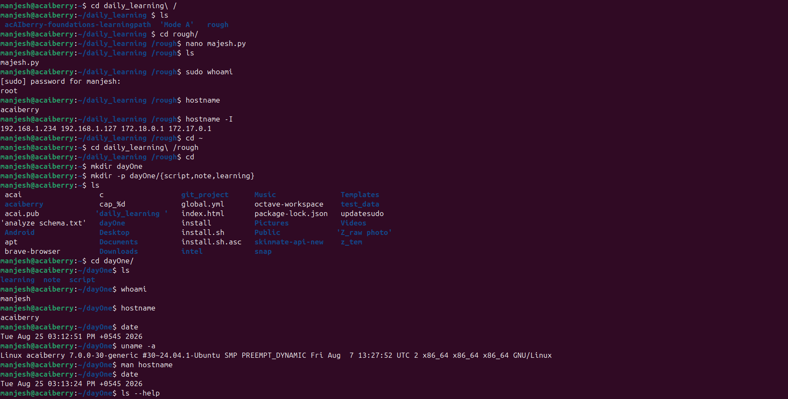

# Day 01: Day 1: Open the terminal and create the project

**Tue Aug 25**

**Time spent:02:35:59 PM +0545 2026**

## Commands I practiced

```text
cd 
mkdir -p project/src/assets/images
whoami
hostname
date
uname -a
man ls
mkdir --help
clear

```

## Task result

learn to make nested folder and the difference command such as whoami , hostname , and way to find system full description 

## Proof

Commit, file, screenshot, command output, or URL:


## One error and its fix

- Symptom:Linux terminal throws a "No such file or directory" error when creating a multiple folder path.
- Evidence:manjesh@acaiberry:~/dayOne$ mkdir animal/cat
    mkdir: cannot create directory ‘animal/cat’: No such file or directory
- Cause:"mkdir" can not create folder if the parents directory doesnot exist 
- Fix: use command "mkdir -p animal/cat/dog"

## Can I explain it without AI?

- [✓] Yes
- [ ] Not yet; repeat this day
