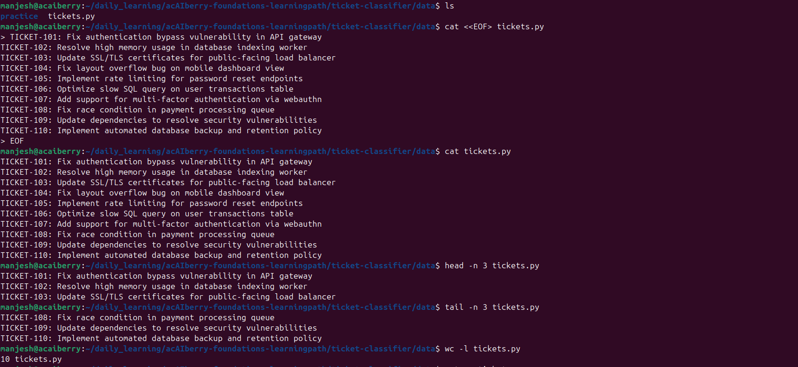

# Day 4: Read files without opening an editor

**Mon Aug 31**

**Time spent:01:16:03 PM +0545 2026**

## Commands I practiced

```text
cat
less
head
tail
wc -l
file
```

## Task result
   I learn the different method of reading content of a file 

## Proof



*manjesh@acaiberry:~/daily_learning/acAIberry-foundations-learningpath/ticket-classifier/data$ file tickets.py 
tickets.py: ASCII text
*manjesh@acaiberry:~/daily_learning/acAIberry-foundations-learningpath/ticket-classifier/data$ file tickets
tickets: empty


## Can I explain it without AI?

- [✓] Yes
- [ ] Not yet; repeat this day

