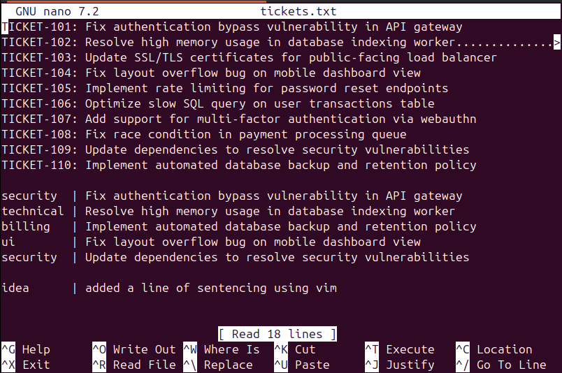

# Day 5: Edit safely with Nano

**Tue Sep 1**

**Time spent:12:45:35 PM to 1:45:20 PM**

## Commands I practiced

```text
nano
clt o
clt w
clt x
vim 
```

## Task result
   I learn the curd operation inside the terminal using nano and vim 

## command description 
**Nano:** Run nano filename, type directly to edit, use Ctrl+W to search, press Ctrl+O then Enter to save, and press Ctrl+X to exit.

**Vim:** Run vim filename, press i to type text, press Esc to stop typing, type /pattern to search, and type :wq then Enter to save and exit.

## Proof



ssifier/data$ vim tickets.txt 
manjesh@acaiberry:~/daily_learning/acAIberry-foundations-learningpath/ticket-classifier/data$ nano tickets.txt 


## Can I explain it without AI?

- [✓] Yes
- [ ] Not yet; repeat this day

