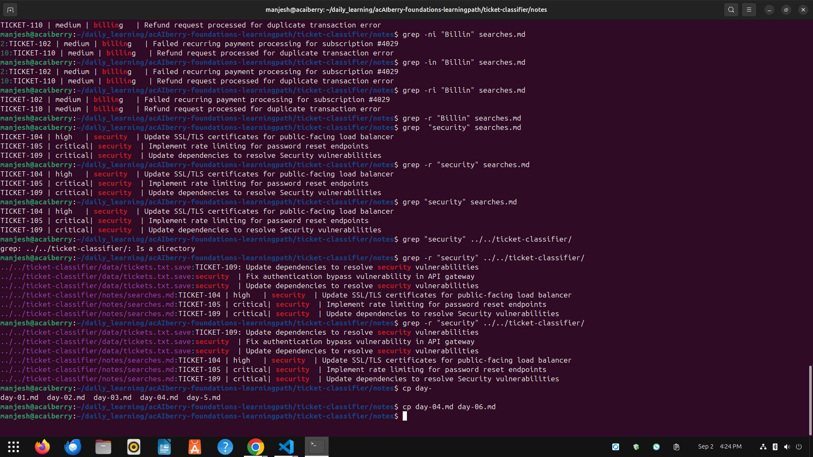

# Day 6: Search text with frep and ripgrep

**Mon Sep 2**

**Time spent:03:30:03 PM  to 04:30:02**

## Commands I practiced

```text
grep 
grep -n
grep -i
grep -r
rg
```

## Task result
   I learned how to search using CLI with in different file 

## Proof




## Can I explain it without AI?

- [✓] Yes
- [ ] Not yet; repeat this day

