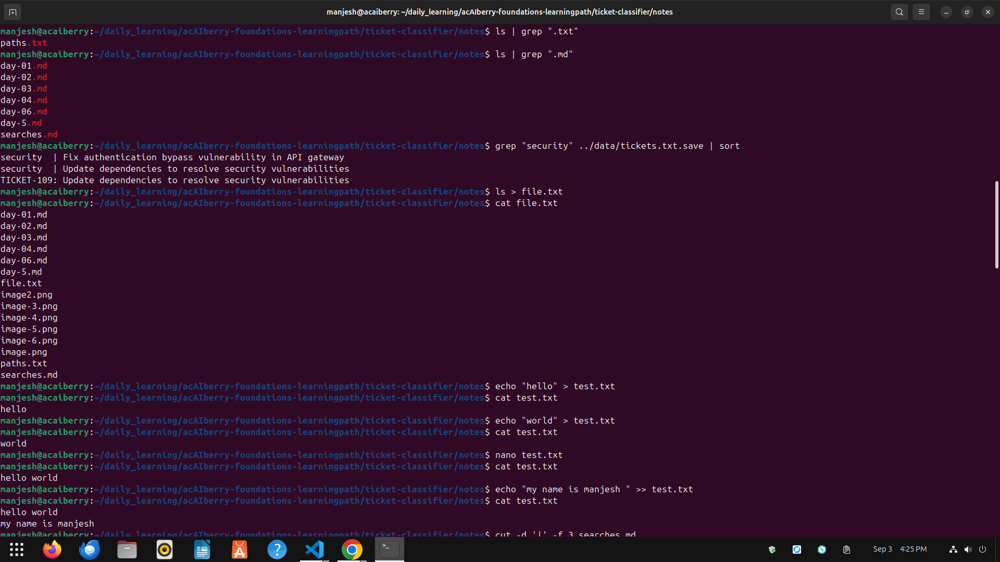
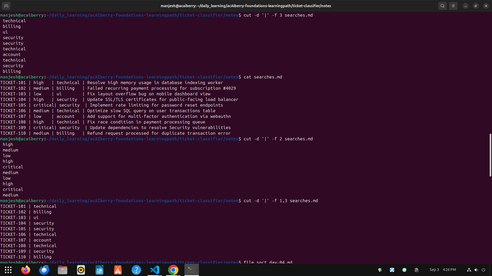
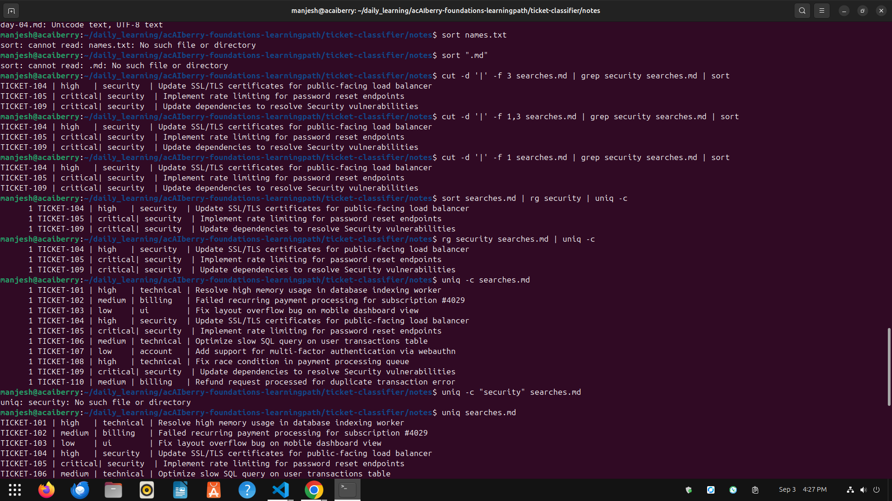

# Day 7: Combine commands with pipes

**Mon Sep 3**

**Time spent:03:30:03 PM  to 04:30:02**

## Commands I practiced

```text
|
>
>>
cut
sort
uniq -c
tee
```

## Task result
   I learned how to Combine commands and make file , append

## Proof





## Can I explain it without AI?

- [✓] Yes
- [ ] Not yet; repeat this day

