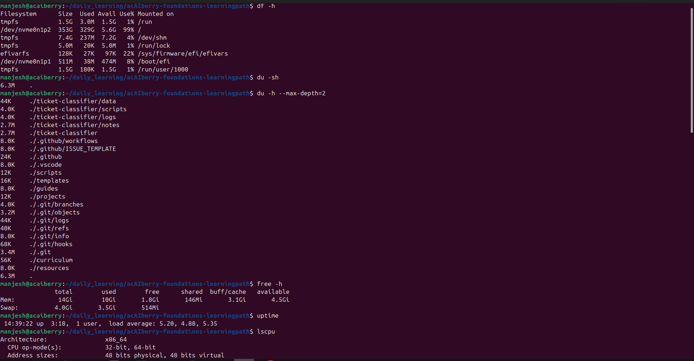

# Day 9: Check disk and memory
**Sun Sep 07**

**Time spent: 02:00 PM to 3:10 PM**

## Commands I practiced

```text
df -h 
du -sh 
du -h --max-depth=1 
free -h
uptime 
lscpu 
nvidia-smi
```

## Task result
 I learn to find the essential detail about the file,repository, about the pc 

 One small mistake I made was running `du -h --max-depth=1.` without a space before `.`. It gave an error because Linux interpreted `1.` as the value for `--max-depth`. I corrected it to `du -h --max-depth=1 .`.

Overall, I was able to check the disk, project size, memory, system load, CPU, and GPU information and record the results.

## Proof

Commit, file, screenshot, command output, or URL:




## Can I explain it without AI?

* [✓] Yes
* [ ] Not yet; repeat this day
