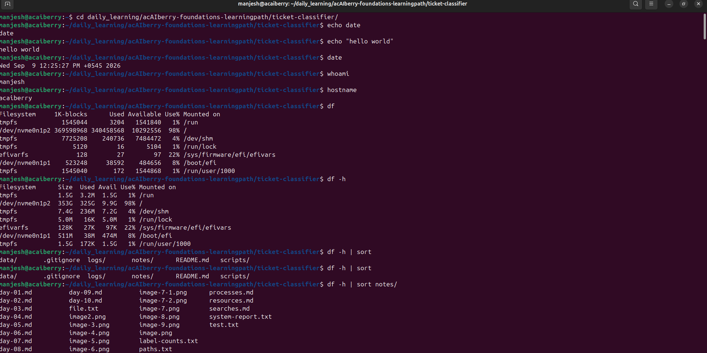

# Day 10: Checkpoint: build a system report
**Sun Sep 07**

**Time spent: 11:00 am to 1:10 PM**

## Commands I practiced

```text
#!/usr/bin/env bash
,
echo
date
whoami
hostname
df
free 
ps 
bash  
```

## Task result
 i learn the basic command of linux ,which help to to navigate through difference directory , CRUD operation , extract essential information such as memory ,disk usuage etc 

## Proof

Commit, file, screenshot, command output, or URL:




## Can I explain it without AI?

* [✓] Yes
* [ ] Not yet; repeat this day
