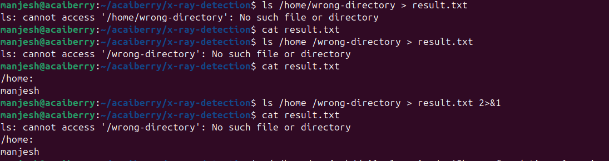
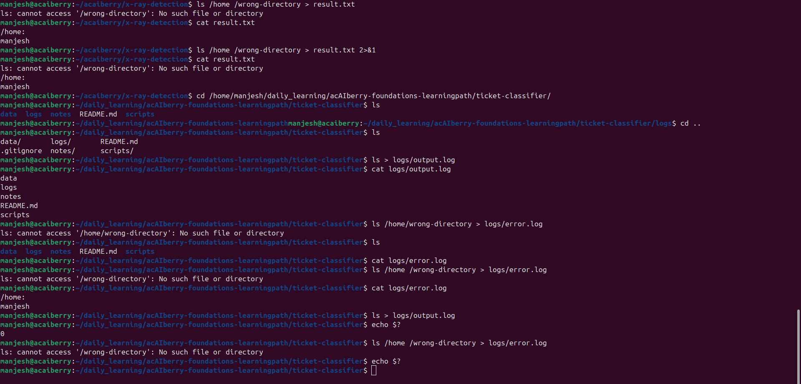

# Day 11: Understand output, errors, and exit codes
**Sun Sep 07**

**Time spent: 02:00 PM to 3:30 PM**

## Commands I practiced

```text
echo $?
>
2> 
2>&1
```

## Task result
  i learn about how to see the status of command just executed, also the difference between > , and 2>&1 

## Proof

Commit, file, screenshot, command output, or URL:





## Can I explain it without AI?

* [✓] Yes
* [ ] Not yet; repeat this day
