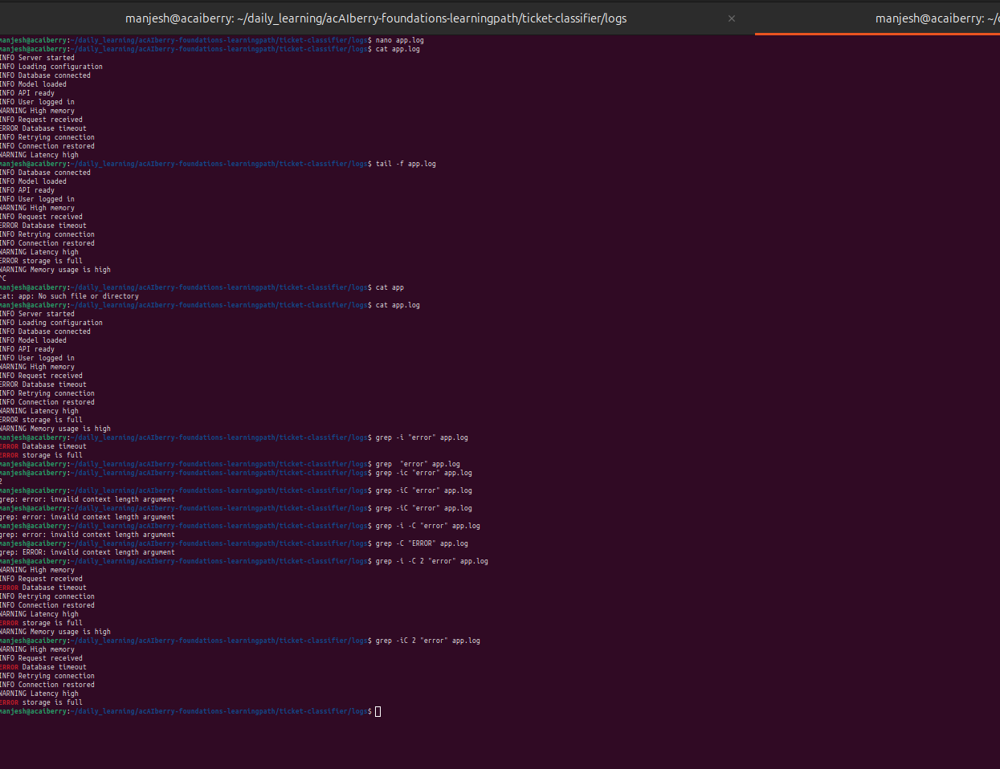

# Day 12: Read changing logs with tail
**Sun Sep 015**

**Time spent: 01:00 PM to 2:00 PM**

## Commands I practiced

```text
 tail -n 
 tail -f 
 grep -i 
 grep -C 
 less +G
```

## Task result
  i learn how to see and follow the continus logs , how to fillter them. 

## Proof

Commit, file, screenshot, command output, or URL:



## Can I explain it without AI?

* [✓] Yes
* [ ] Not yet; repeat this day
