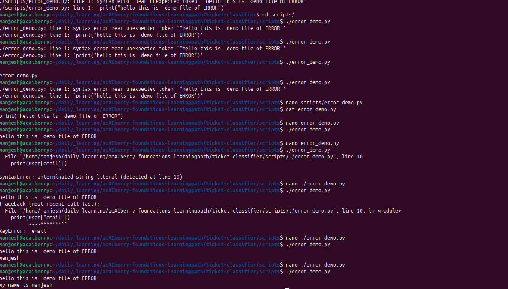
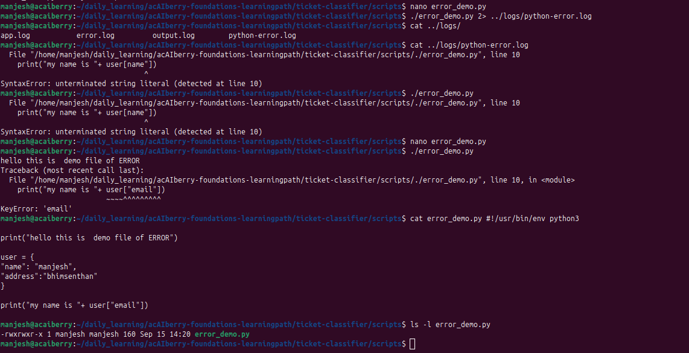

# Day 13: Read a Python traceback

**Sun Sep 015**

**Time spent: 02:00 PM to 2:30 PM**

## Commands I practiced

```text
Python3
grep 
nano
tail
>
```

## Task result
  i learn about how to see the status of command just executed, also the difference between > , and 2>&1 

## Proof

Commit, file, screenshot, command output, or URL:





## Can I explain it without AI?

* [✓] Yes
* [ ] Not yet; repeat this day
