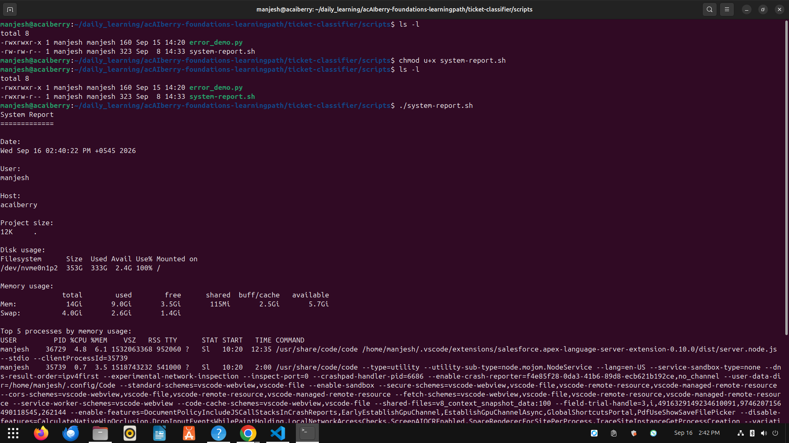
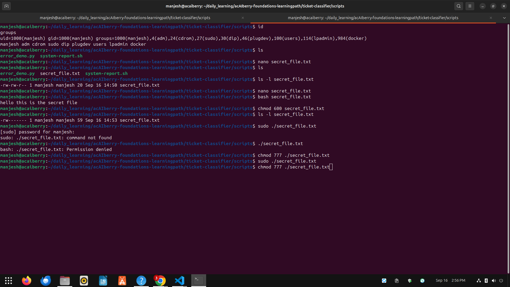

# Day 14: Read a Python traceback

**Sun Sep 15**

**Time spent: 02:00 PM to 2:30 PM**

## Commands I practiced

```text
ls -l 
chmod u+r
chmod 600
id 
groups
sudo -l
```

## Task result
  i learn about how to see the permissions and change them according to owner,user and other

## Proof

Commit, file, screenshot, command output, or URL:




## Can I explain it without AI?

* [✓] Yes
* [ ] Not yet; repeat this day
