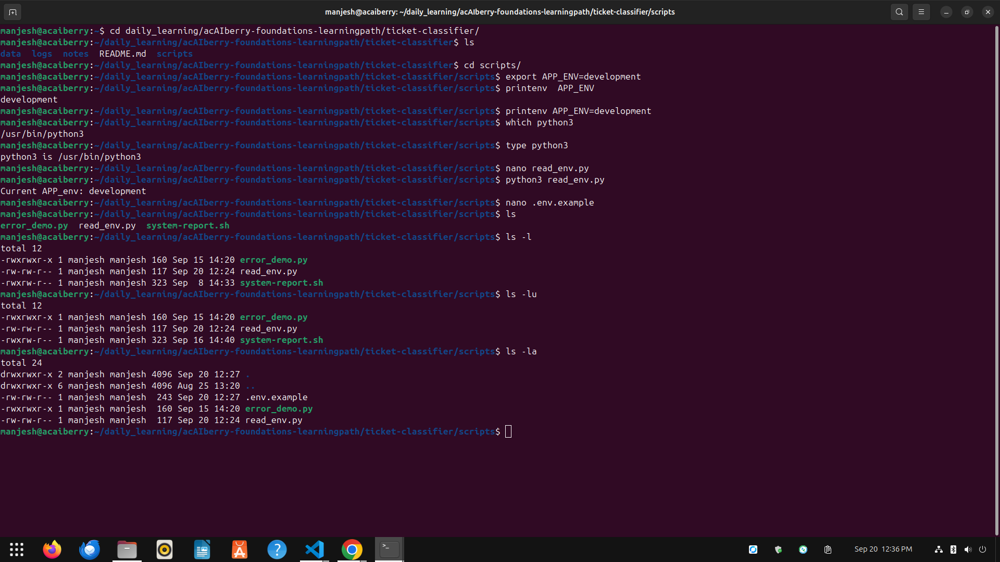

# Day 15: Read a Python traceback

**Sun Sep 20**

**Time spent: 11:00 AM to 12:00 PM**

## Commands I practiced

```text
env 
printenv 
export
PATH
which
type
```

## Task result
  i learn about how to use environment variable and find the extact path's 

## Proof

Commit, file, screenshot, command output, or URL:



## Can I explain it without AI?

* [✓] Yes
* [ ] Not yet; repeat this day
