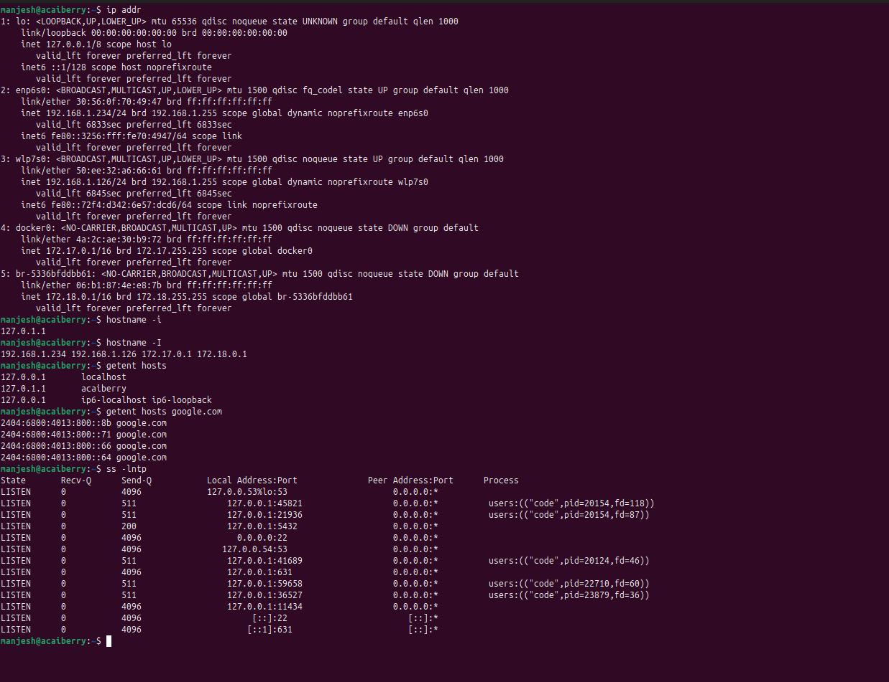
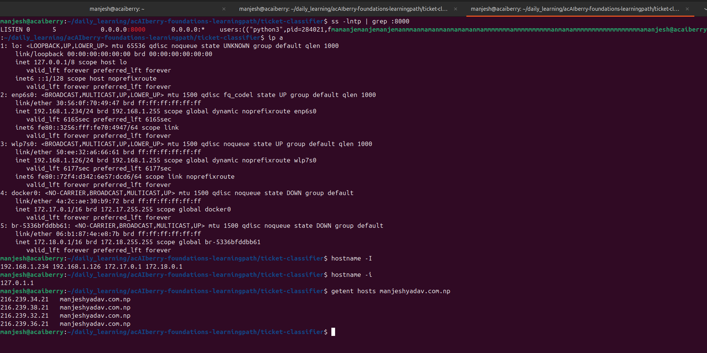

# Day 18: Understand IP addresses, DNS, and ports

**Tue Sep 27**

**Time spent: 10:30 AM to 11:00 AM**

## Goal

Understand the difference between a host, IP address, DNS name, port, and listening process.

## Commands I practiced

```text
systemctl status
systemctl list-units --type=service
journalctl -u
journalctl --since
```

## What I learned
 i learn how to identify the IP address, DNS name ,port and listening process.


## Proof of Learning

Commit, file, screenshot, command output, or URL:



## Can I explain it without AI?

* [✓] Yes
* [ ] Not yet; repeat this day
