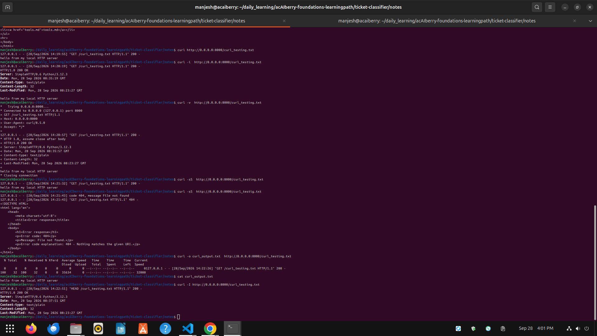
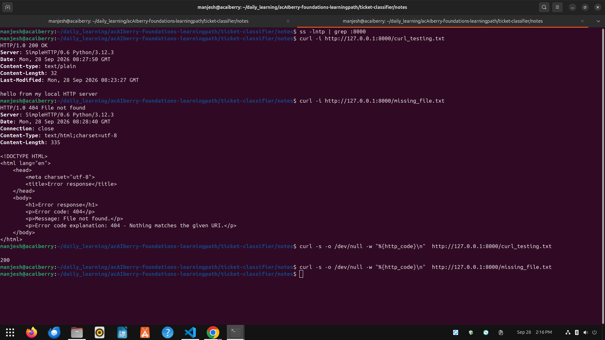

# Day 19: Inspect HTTP with curl
**Mon Sep 28**

**Time spent: 03:00 PM to 04:00 PM**

## Commands I practiced

```text
curl -i 
curl -v 
curl -sS 
curl -o 
curl -w

```

## Task result
  i learn to inspect HTTP and curl 


## Proof

Commit, file, screenshot, command output, or URL:



## Can I explain it without AI?

* [✓] Yes
* [ ] Not yet; repeat this day
