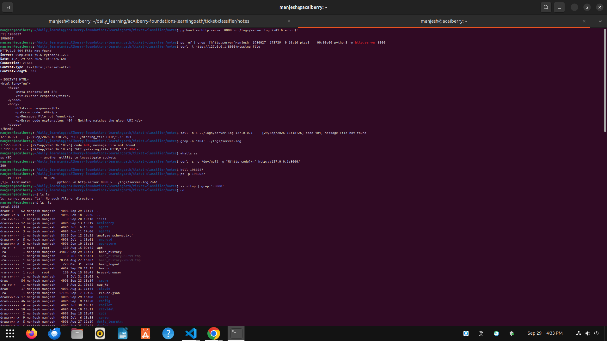
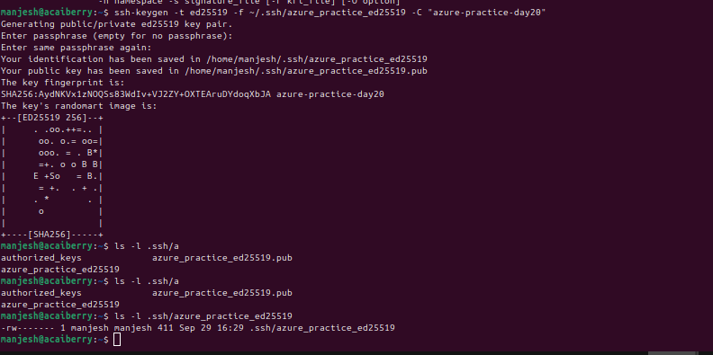

# Day 20: Checkpoint diagnose a local server
**Mon Sep 29**

**Time spent: 03:30 PM to 04:30 PM**

## Commands I practiced

```text
ps 
ss
tail 
grep 
curl 
kill
ssh-keygen 
ssh -i

```

## Symptom
Requesting http://127.0.0.1:8000/does-not-exist returned HTTP 404.

## Commands
- python3 -m http.server 8000 > logs/server.log 2>&1 &
- ps -ef | grep '[h]ttp.server'
- ss -tlnp | grep ':8000'
- curl -i http://127.0.0.1:8000/does-not-exist
- grep -n ' 404 ' logs/server.log
- kill <PID>
- ssh-keygen -t ed25519 -f ~/.ssh/azure_practice_ed25519 -C "azure-practice-day20"

## Evidence
- PID: <PID>, listening on port 8000 (from ps and ss).
- curl status line: HTTP/1.0 404 File not found
- Log line (line N): "GET /does-not-exist HTTP/1.1" 404 -
- After kill <PID>, ps and ss showed nothing.
- Key fingerprint (public, safe): SHA256:<fingerprint>

## Cause
The server was healthy. The requested path does not exist in the served
directory, so the correct response is 404.

## Fix
Request a path that exists (curl / returned 200), or create the missing file.
No server change needed.


