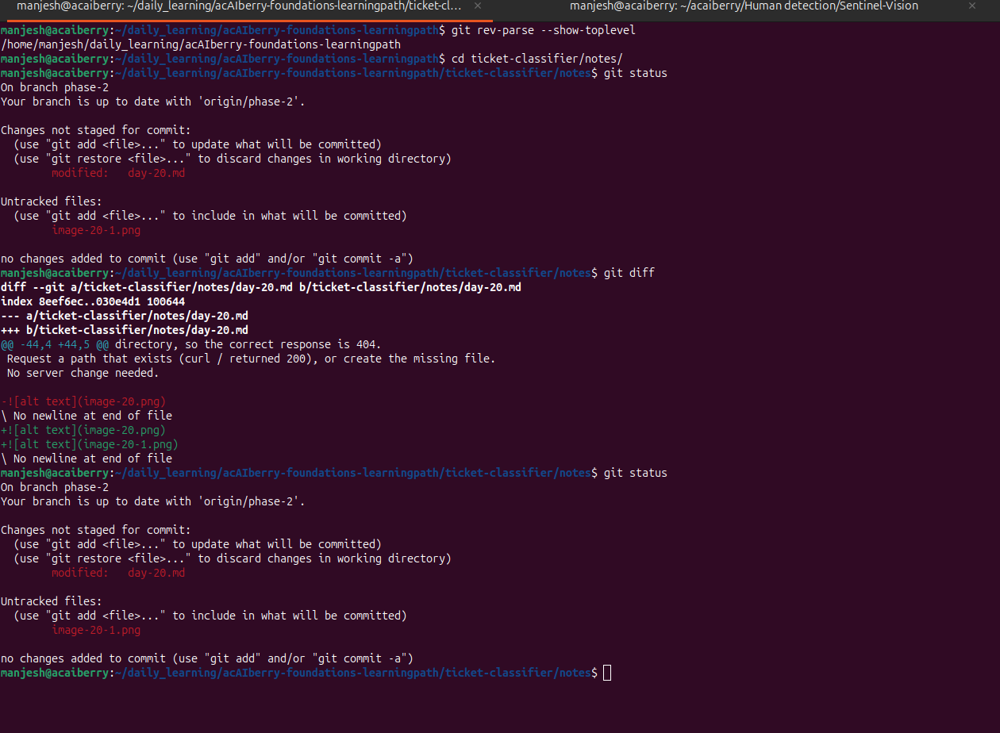

# Day 21: Start tracking with Git

**Thu Oct 01**

**Time spent: 03:30 PM to 4:0 PM**

## Commands I practiced

```text
git init
git rev-parse --show-toplevel
git status
git diff
```

## Task result
  i learn about how to see git ,working tree and git status

## Proof

Commit, file, screenshot, command output, or URL:



## Can I explain it without AI?

* [✓] Yes
* [ ] Not yet; repeat this day
