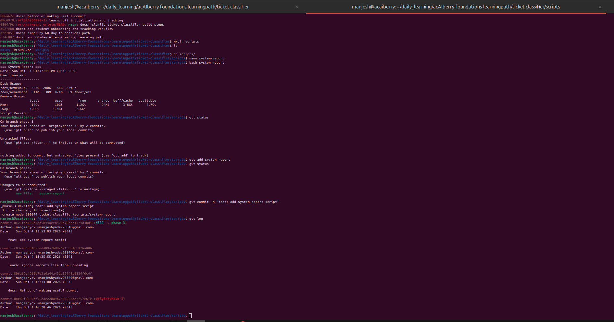

# Day 22: Make useful commitst

**Thu Oct 02**

**Time spent: 02:30 PM to 3:0 PM**

## Commands I practiced

```text
git add
git diff --staged 
git commit 
git log --oneline 
git show
```

## Task result
  i learn about how make usful commit 

## Proof

Commit, file, screenshot, command output, or URL:



## Can I explain it without AI?

* [✓] Yes
* [ ] Not yet; repeat this day
