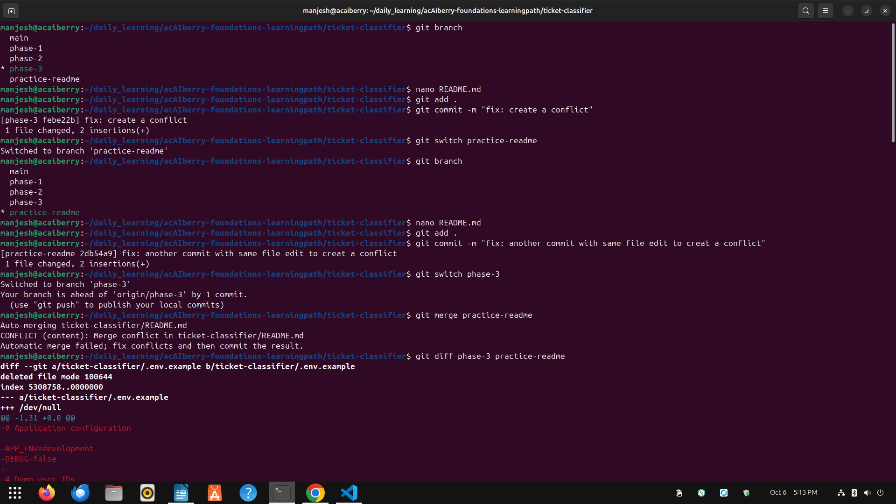
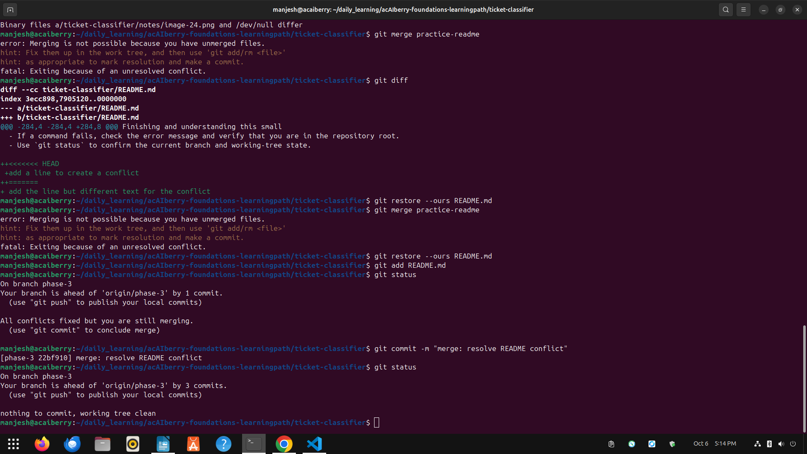

# Day 22: Make useful commitst

**Thu Oct 02**

**Time spent: 02:30 PM to 3:0 PM**

## Commands I practiced

```text
git status, 
git diff, 
git restore, 
git revert, 
git reflog
```

## Task result
  i learn about how resolve a conflict and undo safely

## Proof

Commit, file, screenshot, command output, or URL:



## Can I explain it without AI?

* [✓] Yes
* [ ] Not yet; repeat this day
