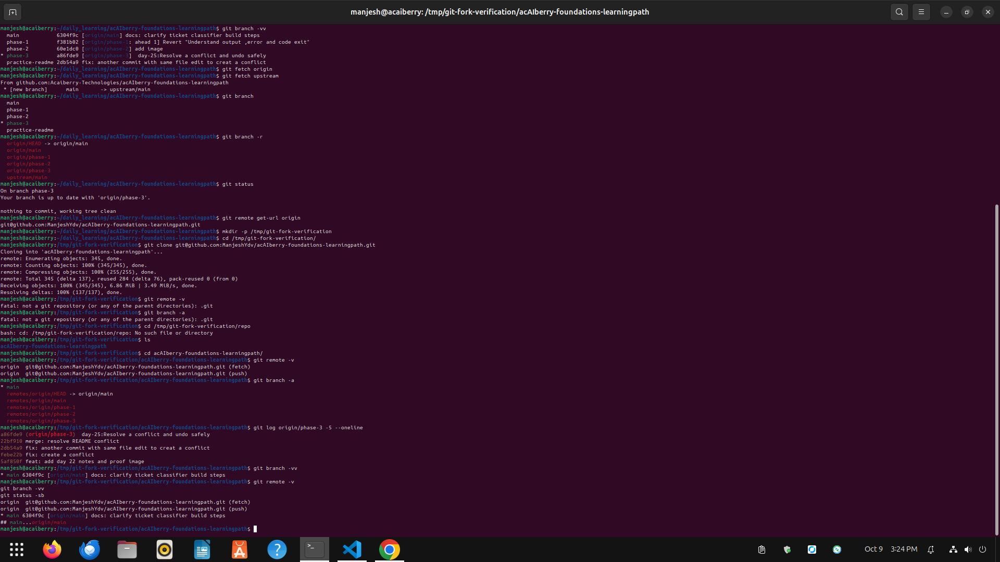

# Day 26: Connect Git to GitHub

**Thu Oct 09**

**Time spent: 03:30 PM to 4:0 PM**

## Commands I practiced

```text
git remote -v
git push -u origin main 
git fetch
git pull --ff-only 
git clone
```

## Task result
  i learn about how to connect git and gitHub 

## Proof

Commit, file, screenshot, command output, or URL:



## Can I explain it without AI?

* [✓] Yes
* [ ] Not yet; repeat this day
